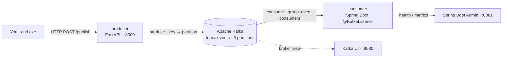
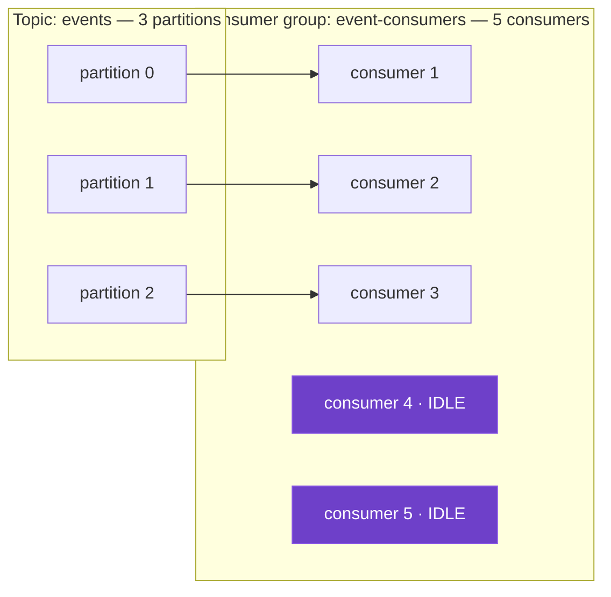

# Cloud-Native Learning Lab — Lab Manual

A hands-on, follow-along manual for learning the **cloud-native / microservices** stack by
building real systems and *observing* how they behave. Managed as a **monorepo**, grown in
**versioned batches** (SemVer), built **entirely on open-source / free tooling**.

> **Manual version:** `v1.0.0` · **Platform:** Windows 11/10 (PowerShell) · **Assumes:** no prior
> Docker/Kafka/Kubernetes experience — every install and validation step is spelled out.

> **How this manual works:** each numbered **Exercise** is a small unit of work with a clear
> action, an expected result, and a checkpoint. Do them in order. Don't move past a
> **✅ CHECKPOINT** until you've seen the expected result — that's how you know it clicked.

---

## How to use this manual (conventions)

| Marker | Meaning |
|---|---|
| 🎯 **Objectives** | What you'll be able to do after the lab |
| 🧰 **Setup** | Tools/files you need before starting |
| ▶️ **Do** | An action to perform |
| 💻 (code block) | The exact command or file contents |
| 👀 **Expect** | What you should see if it worked |
| 📝 **Record** | Write down what you observed (fill-in table) — this is how you learn |
| 🧠 **Why** | The concept behind the step |
| ✅ **CHECKPOINT** | Stop and verify before continuing |
| 🧹 **Cleanup** | How to tear it down |

**Tips before you start**
- **Run commands ONE AT A TIME.** Where a step shows several commands, enter them individually
  (type or paste a single line, press Enter, wait, then the next). Pasting a multi-line block into
  PowerShell often splits a line or drops into a `>>` continuation prompt and silently runs the
  wrong thing. If you ever see `>>`, press **Ctrl+C** to reset.
- Keep **two terminals** open: one to run commands, one to tail logs.
- Keep **Kafka UI** (http://localhost:8080) open in a browser once it's up.
- When a step says *Record*, actually write it in the table. The tables are the point.

---

## Ground rules

1. **Open-source / free only** — no paid licenses or expiring trials. Docker Desktop is avoided
   in favor of **Docker Engine / Rancher Desktop**.
2. **Monorepo** — one lab per numbered folder under `labs/`; each lab is self-contained.
3. **SemVer batches** — MAJOR = new lab, MINOR = addition within a lab, PATCH = fix.
4. **Learn by observing** — every exercise ends in something you can see and record.

## Roadmap at a glance

| Version | Folder | Focus | Status |
|---|---|---|---|
| **v1.0** | `labs/01-kafka` | Kafka partitioning, consumer groups, rebalancing, Docker → Kubernetes | **performable now** |
| v1.1 | `labs/01-kafka` | KEDA lag-based autoscaling | preview |
| v1.2 | `labs/01-kafka` | Schema Registry + Avro, dead-letter topics | preview |
| **v2.0** | `labs/02-spring-microservices` | Spring Boot microservices ecosystem | preview |
| v2.1 | `labs/02-spring-microservices` | Contract-first REST (OpenAPI/Swagger) + gRPC service-to-service | preview |
| **v3.0** | `labs/03-observability` | Metrics, logs, traces over the whole stack | preview |

## Monorepo layout

```
cloud-native-learning-lab/
├── GUIDE.md                       ← this lab manual
├── README.md                      ← short index (create when scaffolding)
├── labs/
│   ├── 01-kafka/                  ← LAB 1 (v1.x)
│   │   ├── docker-compose.yml
│   │   ├── producer/              ← Python FastAPI producer
│   │   ├── consumer/              ← Spring Boot consumer (Gradle)
│   │   ├── admin-server/          ← Spring Boot Admin UI (monitors the consumer)
│   │   └── k8s/                   ← kind manifests
│   ├── 02-spring-microservices/   ← LAB 2 (v2.x)
│   └── 03-observability/          ← LAB 3 (v3.x)
└── shared/                        ← cross-lab helpers (only if needed)
```

> **Working directory (no hardcoded paths).** After you clone/create the repo, open PowerShell in
> the Kafka lab folder. This manual never hardcodes an absolute path — instead, set `$LAB` **once**
> to wherever *your* clone lives, and every Lab 1 command reuses it:
> ```powershell
> # adjust the left side to wherever you cloned the repo, then run this once per session:
> $LAB = "$HOME\cloud-native-learning-lab\labs\01-kafka"   # example location
> cd $LAB
> ```
> If you're already sitting in the lab folder, `$LAB = (Get-Location).Path` works too. Wherever you
> see `cd $LAB` below, it just returns you to this folder.

---
---

# The tool stack — what each tool is & why we use it

Before touching commands, here's the mental model of every tool in Lab 1: **what it is**, **its
job in this system**, and **why we picked it** (all free/OSS). Later labs add more tools; they'll
get the same treatment when we reach them.

### Containers & runtime

- **Docker (engine).** *What:* software that packages an app + its dependencies into an isolated,
  portable **container** that runs the same everywhere. *Job here:* runs Kafka, Kafka UI, the
  producer, and the consumer as separate containers without installing any of them on Windows
  directly. *Why:* the whole lab is about running distributed pieces that talk over a network —
  containers make that reproducible on one laptop.
- **Rancher Desktop.** *What:* a free/open-source desktop app that provides the Docker engine
  (and a local Kubernetes) on Windows/Mac. *Job here:* gives you the `docker` command. *Why:* OSS,
  no licensing terms (unlike Docker Desktop for larger orgs). We run it with the **dockerd (moby)**
  engine so the `docker` CLI works exactly as written.
- **WSL2 (Windows Subsystem for Linux).** *What:* a real Linux kernel running inside Windows.
  *Job here:* Docker containers are Linux containers; WSL2 is the Linux environment they actually
  run in. *Why:* it's how Docker/Kafka run natively-fast on Windows. (This is why keeping WSL
  updated mattered during setup.)

### The messaging backbone

- **Apache Kafka.** *What:* a distributed **event streaming platform** — a durable, ordered,
  replayable log that producers write to and consumers read from. *Job here:* the central broker
  all events flow through; the star of Lab 1. *Why:* the industry-standard OSS event bus, and the
  perfect vehicle for learning partitioning and consumer-group scaling.
- **KRaft mode.** *What:* Kafka's built-in consensus/metadata system (Kafka Raft). *Job here:* lets
  a single Kafka node manage its own metadata. *Why:* older Kafka needed a **separate ZooKeeper**
  service; KRaft removes that, so our setup is one container instead of two — simpler to learn.
- **Kafka UI (provectuslabs/kafka-ui).** *What:* a free web dashboard for Kafka. *Job here:* your
  window into topics, partitions, messages, consumer groups, and **lag** — so concepts are visible,
  not abstract. *Why:* OSS, zero-config, and turns invisible broker state into something you watch.

### The producer side (Python)

- **Python.** *What:* general-purpose language. *Job here:* implements the producer service. *Why:*
  fastest way to write a tiny REST API; contrasts nicely with the Java consumer (Kafka is
  polyglot).
- **FastAPI.** *What:* a modern Python web framework for building REST APIs. *Job here:* exposes
  `/publish` and `/publish-bulk` HTTP endpoints you call to send events. *Why:* minimal boilerplate,
  auto-validation, OSS.
- **uvicorn.** *What:* the ASGI web server that actually runs a FastAPI app. *Job here:* serves the
  producer on port 8000. *Why:* the standard way to run FastAPI.
- **confluent-kafka.** *What:* a Python Kafka client library. *Job here:* the code that connects to
  the broker and publishes messages (computes the partition from the key). *Why:* fast, widely used,
  OSS.
- **pydantic.** *What:* data-validation library (bundled with FastAPI). *Job here:* defines the
  `Event` request shape (`key`, `message`) and rejects malformed input. *Why:* free request
  validation.

### The consumer side (Java / Spring)

- **Java 21 (OpenJDK LTS).** *What:* the language/runtime for the consumer. *Job here:* runs the
  Spring Boot consumer service. *Why:* current LTS; see the Java-version rationale in Exercise 1.0.e.
- **Spring Boot.** *What:* the dominant Java framework for building production services with minimal
  configuration. *Job here:* the consumer application skeleton (`@SpringBootApplication`, config,
  lifecycle). *Why:* what most real Kafka consumers are built on; sets you up for Lab 2's
  microservices.
- **Spring for Apache Kafka (spring-kafka).** *What:* Spring's Kafka integration. *Job here:*
  provides `@KafkaListener`, which handles polling, offset commits, and **rebalancing** for you —
  so you observe rebalancing rather than hand-code it. *Why:* the standard, OSS way to consume Kafka
  in Spring.
- **Gradle.** *What:* a modern Java build/dependency tool using a concise Groovy/Kotlin build script
  (`build.gradle`). *Job here:* downloads dependencies and builds the runnable Spring Boot jar via the
  `bootJar` task. *Why:* fast (incremental builds, build cache), less verbose than Maven's XML, and
  first-class Spring Boot support; the multi-stage Dockerfile runs it for you (no local install needed).
- **Spring Boot Actuator.** *What:* a Spring Boot module that exposes operational HTTP endpoints
  (`/actuator/health`, `/actuator/metrics`, `/actuator/loggers`, `/actuator/env`, …). *Job here:*
  makes the consumer's internals inspectable — and is what Spring Boot Admin reads. *Why:* the
  standard way to make a Spring service observable; also the foundation for Lab 3.
- **Spring Boot Admin (de.codecentric).** *What:* a free/OSS web UI that aggregates the Actuator
  endpoints of your Spring Boot apps into a live dashboard. *Job here:* your **"boot UI"** — watch the
  consumer's health, JVM metrics, log levels, threads, and environment in the browser, and see each
  instance appear/disappear as you scale. *Why:* the Spring counterpart to Kafka UI — turns the
  consumer's internal state into something you can see (keeps with "learn by observing").

### Kubernetes (Phase 5)

- **Kubernetes (k8s).** *What:* a container **orchestrator** — it schedules containers (as *pods*),
  restarts them, networks them, and scales them across machines. *Job here:* runs the same Kafka
  system as Phase 1–4, but the "real" way, so you scale consumers with `kubectl scale` and watch
  rebalancing at the orchestration layer. *Why:* the industry standard for running containers in
  production; the destination this whole lab builds toward.
- **kubectl.** *What:* the command-line client for talking to any Kubernetes cluster. *Job here:*
  applies manifests, scales deployments, tails pod logs. *Why:* the universal k8s CLI.
- **kind (Kubernetes-in-Docker).** *What:* runs a real Kubernetes cluster **inside Docker
  containers** on your laptop. *Job here:* your local, disposable, free k8s cluster for Phase 5.
  *Why:* fully OSS, nothing to license, and tears down cleanly — ideal for learning.

### Utility

- **curl.exe.** *What:* a command-line HTTP client (built into Windows 10/11). *Job here:* sends the
  POST requests that trigger the producer to publish events. *Why:* already installed; just remember
  to call `curl.exe` in PowerShell (see Exercise 1.0.h).

**How they fit together (Lab 1):** you run `curl.exe` → hits the **FastAPI** producer (Python) →
which uses **confluent-kafka** to publish to **Apache Kafka** → the **Spring Boot** consumer
(`@KafkaListener` via **spring-kafka**) reads and prints which partition/pod handled it. You watch
the **broker** side in **Kafka UI** (topics, partitions, lag) and the **consumer** side in the
**boot UI** / Spring Boot Admin (health, metrics, instances). Phases 1–4 run everything as
**Docker** containers; Phase 5 runs them as **Kubernetes** pods on a **kind** cluster.



---
---

# LAB 1 — Kafka core

| | |
|---|---|
| **Lab version** | `v1.0.0` |
| **Folder** | `labs/01-kafka` |
| **Depends on** | nothing (start here) |
| **Add-ons** | `v1.1` KEDA autoscaling · `v1.2` Schema Registry + DLT (previews below) |
| **Status** | performable now |

### 🎯 Objectives
By the end of this lab you will be able to:
1. Run Apache Kafka (KRaft, single node) and Kafka UI locally with Docker Compose.
2. Explain and demonstrate **why parallelism = `min(partitions, consumers)`**.
3. Produce keyed events and show that **same key → same partition**.
4. Scale consumers and **watch a live rebalance**; prove idle consumers past the partition count.
5. Add partitions live and observe **key remapping** + Kafka's refusal to shrink partitions.
6. Reproduce the entire system on real **Kubernetes** with `kind` and `kubectl scale`.

### ⏱️ Estimated time
2–3 hours (Phases 1–4 ≈ 90 min; Phase 5 Kubernetes ≈ 60 min).

### 🧠 The one rule that explains everything
> **Within one consumer group, each partition is consumed by exactly one consumer at a time.**
> So effective parallelism = `min(partitions, consumers)`.

| Partitions | Consumers | Result |
|-----------:|----------:|--------|
| 3 | 1 | one consumer does all the work |
| 3 | 3 | perfect spread — 1 partition each |
| 3 | 5 | **2 consumers sit idle** (partitions cap it) |
| 6 | 5 | all busy; one consumer handles 2 partitions |

You will *prove each of these rows yourself* in the experiments. Visually — the 3-partition,
5-consumer case (the surprising one):



Each partition feeds exactly one consumer; the extra two consumers get nothing because
`min(3 partitions, 5 consumers) = 3`. Add a 4th and 5th partition and the idle ones light up — that's
Experiment C.

---

## Exercise 1.0 — Set up your Windows environment (from scratch)

This exercise assumes a **fresh Windows machine with nothing installed**. You'll install each tool,
then immediately **validate** it before moving on. Do the sub-steps in order — later tools depend on
earlier ones.

> **Golden rule for Windows installs:** after installing anything that adds a command, **close and
> reopen PowerShell** (or open a new tab). New tools are added to your `PATH`, and an already-open
> terminal won't see them until it restarts. If a freshly installed command says *"not recognized"*,
> 90% of the time you just need a new terminal.

### 1.0.a — Open PowerShell (your main tool)

▶️ **Do.** Press `Win`, type **PowerShell**, and click **Windows PowerShell**. For installs you'll
sometimes need admin: right-click → **Run as administrator**.

▶️ **Do (validate).**
```powershell
$PSVersionTable.PSVersion    # shows your PowerShell version
```
👀 **Expect.** A version number (5.1 or higher is fine).
✅ **CHECKPOINT 1.0.a.** PowerShell opens and prints a version.

### 1.0.b — Confirm `winget` (the Windows package manager)

`winget` comes built into Windows 11 and recent Windows 10. We use it to install most tools.

▶️ **Do (validate).**
```powershell
winget --version
```
👀 **Expect.** A version like `v1.x.x`.
🛠️ **If "not recognized":** install **App Installer** from the Microsoft Store (search "App
Installer"), then reopen PowerShell and retry.
✅ **CHECKPOINT 1.0.b.** `winget --version` prints a version.

### 1.0.c — Install Docker (via Rancher Desktop — OSS, no license)

Docker runs all our containers. We use **Rancher Desktop** (fully open-source) to avoid Docker
Desktop's licensing terms. It provides the `docker` command.

▶️ **Do (install).**
```powershell
winget install --id SUSE.RancherDesktop -e
```
*(Alternative — Docker Desktop, free for personal use: `winget install --id Docker.DockerDesktop -e`.
Either gives you the `docker` command; the rest of the manual is identical.)*

▶️ **Do (first-run setup).**
1. Launch **Rancher Desktop** from the Start menu.
2. When prompted, choose container engine **dockerd (moby)** — this is what gives the `docker` CLI.
3. Wait for the whale/status to show **running** (first start downloads components — a few minutes).
4. **Close and reopen PowerShell** so `docker` is on your PATH.

▶️ **Do (validate).**
```powershell
docker --version
docker run --rm hello-world
```
👀 **Expect.** `docker --version` prints a version; `hello-world` prints *"Hello from Docker!"*.

🛠️ **If it fails — common Windows first-run snags (in order):**

1. **`WSL … is too old` / `wsl.exe exited with code 1`** — the WSL platform predates the engine.
   This blocks Rancher Desktop's first-run setup entirely. Fix:
   ```powershell
   wsl --update
   wsl --version        # confirm it bumped (want 2.2+; newer is fine)
   wsl --shutdown       # restart WSL cleanly
   ```
   Then fully quit and reopen Rancher Desktop so it re-provisions on the updated WSL.
2. **Engine not started yet** — Rancher Desktop can take a few minutes on first start (it also
   brings up its own Kubernetes). Wait until the app shows **running**. You can restart its backend
   from a terminal with `rdctl shutdown` then `rdctl start`.
3. **`docker` not recognized** *and/or* **`error getting credentials … docker-credential-wincred …
   executable file not found`** — Rancher Desktop's bin folder isn't on your PATH (its automatic
   PATH integration didn't run — often a side effect of snag #1). Both the `docker` CLI *and* its
   credential helper live there. Add it to your **user PATH** (no admin needed):
   ```powershell
   $rbin = "C:\Program Files\Rancher Desktop\resources\resources\win32\bin"
   [Environment]::SetEnvironmentVariable("Path",
     ([Environment]::GetEnvironmentVariable("Path","User").TrimEnd(';') + ";" + $rbin), "User")
   ```
   Then **open a new PowerShell** (PATH changes only apply to new terminals) and retry.
4. **Podman also installed?** If you see errors mentioning `podman-machine-default`, you have Podman
   *and* Rancher Desktop competing over WSL. For this lab you only need Rancher Desktop — quit or
   uninstall Podman Desktop, or just leave its (stopped) machine alone once WSL is updated.

✅ **CHECKPOINT 1.0.c.** `hello-world` prints its greeting **from a freshly opened terminal**. This
proves Docker actually works — the most important checkpoint in setup.

> 🧠 **Why dockerd (moby), not containerd?** Rancher Desktop offers two engines:
> **dockerd (moby)** gives you the classic `docker` / `docker compose` CLI; **containerd** is the
> leaner CNCF runtime you drive with `nerdctl` instead. We choose **dockerd** because:
> 1. **This manual is written in `docker` commands** — every `docker compose up`, `docker build`,
>    `docker exec` works verbatim. With containerd you'd translate each to `nerdctl`, which is
>    *mostly* compatible but not identical — needless friction while you're learning Kafka/k8s.
> 2. **`kind` (Phase 5) assumes a Docker-compatible daemon** — `docker build` + `kind load
>    docker-image` is smoothest on dockerd.
> 3. **`docker compose` is first-class** on dockerd, and Compose drives Phases 1–4.
>
> The nice nuance: containerd isn't being avoided — it's the *more* cloud-native runtime, and the
> containers **inside** your `kind` cluster (Phase 5) are run by containerd automatically, no matter
> what you pick here. So: **host CLI = Docker (for convenience), in-cluster runtime = containerd.**
> If you'd rather use `nerdctl`/containerd as your host engine too, it works — you'd just translate
> the `docker` commands.

### 1.0.d — Install Python 3.12

The producer is a Python app.

▶️ **Do (install).**
```powershell
winget install --id Python.Python.3.12 -e
```
▶️ **Do.** Close and reopen PowerShell.

▶️ **Do (validate).**
```powershell
python --version
pip --version
```
👀 **Expect.** `Python 3.12.x` and a `pip` version.
🛠️ **If "not recognized":** reopen the terminal; if still failing, re-run the installer and ensure
**"Add python.exe to PATH"** is checked.
✅ **CHECKPOINT 1.0.d.** Both `python` and `pip` report versions.

### 1.0.e — Install Java 21 (OpenJDK LTS)

The consumer is a Spring Boot (Java) app. We use **Java 21** — the current LTS (Long-Term Support)
release, modern (adds virtual threads) and fully supported by the Spring Boot version in this lab.
*(17 is the older LTS floor; 25 is the newest LTS but would need a newer Spring Boot.)*

▶️ **Do (install).**
```powershell
winget install --id Microsoft.OpenJDK.21 -e
```
▶️ **Do.** Close and reopen PowerShell.

▶️ **Do (validate).**
```powershell
java -version
```
👀 **Expect.** Version text mentioning `21` (e.g. `openjdk version "21.0.x"`).
🛠️ **If "not recognized":** reopen the terminal. If it persists, check `JAVA_HOME` isn't pointing at
an old JDK: `echo $env:JAVA_HOME`.
✅ **CHECKPOINT 1.0.e.** `java -version` shows a 21.x version.

### 1.0.f — Install kubectl (Kubernetes CLI)

`kubectl` is how you talk to any Kubernetes cluster.

▶️ **Do (install).**
```powershell
winget install --id Kubernetes.kubectl -e
```
▶️ **Do.** Close and reopen PowerShell.

▶️ **Do (validate).**
```powershell
kubectl version --client
```
👀 **Expect.** A client version (e.g. `Client Version: v1.3x.x`). *(It's normal to see a note that it
can't reach a server yet — you have no cluster until Phase 5.)*
✅ **CHECKPOINT 1.0.f.** `kubectl version --client` prints a client version.

### 1.0.g — Install kind (Kubernetes-in-Docker)

`kind` runs a real Kubernetes cluster inside Docker — free, local, disposable.

▶️ **Do (install).**
```powershell
winget install --id Kubernetes.kind -e
```
▶️ **Do.** Close and reopen PowerShell.

▶️ **Do (validate).**
```powershell
kind version
```
👀 **Expect.** A version like `kind v0.2x.x`.
✅ **CHECKPOINT 1.0.g.** `kind version` prints a version. *(kind needs Docker running — which you
already validated in 1.0.c.)*

### 1.0.h — Confirm `curl.exe` (already on Windows — use `curl.exe`, not `curl`)

You'll use curl to hit the producer's REST API. **Windows 10/11 ships it built-in — nothing to
install.** But there's a critical PowerShell gotcha:

> ⚠️ **In PowerShell, `curl` is an alias for `Invoke-WebRequest`, not the real curl.** So
> `curl --version` becomes `Invoke-WebRequest --version` and fails with
> *"The remote name could not be resolved: '--version'"*. **Always call `curl.exe`** (with the
> `.exe`) to get the real tool. This matters for every curl command in this manual — they all use
> `-X`, `-H`, `-d` flags that only the real curl understands.

▶️ **Do (validate).**
```powershell
curl.exe --version
```
👀 **Expect.** A `curl 8.x.x` (or `7.x.x`) version line — **not** a web error.
🛠️ **If truly missing** (very old Windows): `winget install --id cURL.cURL -e`, then reopen the
terminal. You still call it as `curl.exe`.
✅ **CHECKPOINT 1.0.h.** `curl.exe --version` prints a version.

### 1.0.i — (Optional) A code editor

Any text editor works, but **VS Code** (free/OSS) makes editing the project files pleasant:
```powershell
winget install --id Microsoft.VisualStudioCode -e
```

### 1.0 — Final environment record

📝 **Record** the version of each tool. Every row must be filled before you start Phase 1.

| Tool | Command | Version you have | OK? |
|---|---|---|---|
| Docker | `docker --version` |  |  |
| Docker works | `docker run --rm hello-world` | (greeting seen?) |  |
| Python | `python --version` |  |  |
| pip | `pip --version` |  |  |
| Java | `java -version` |  |  |
| kubectl | `kubectl version --client` |  |  |
| kind | `kind version` |  |  |
| curl | `curl.exe --version` |  |  |

✅ **CHECKPOINT 1.0 (gate).** Every tool reports a version **and** `docker run hello-world` printed
its greeting. Do not continue to Phase 1 until this whole table is filled.

---

## Phase 1 — Kafka + Kafka UI running locally

Goal: get Kafka up and *see* it in a browser before writing any code.

### Exercise 1.1 — Create the Compose file

▶️ **Do.** Create `labs/01-kafka/docker-compose.yml`:
```yaml
services:
  kafka:
    image: apache/kafka:3.8.0
    container_name: kafka
    ports:
      - "9092:9092"      # internal listener (for containers)
      - "29092:29092"    # host listener (for apps running on your laptop)
    environment:
      KAFKA_NODE_ID: 1
      KAFKA_PROCESS_ROLES: broker,controller
      KAFKA_CONTROLLER_QUORUM_VOTERS: 1@kafka:9093
      KAFKA_LISTENERS: PLAINTEXT://:9092,CONTROLLER://:9093,PLAINTEXT_HOST://:29092
      KAFKA_ADVERTISED_LISTENERS: PLAINTEXT://kafka:9092,PLAINTEXT_HOST://localhost:29092
      KAFKA_CONTROLLER_LISTENER_NAMES: CONTROLLER
      KAFKA_LISTENER_SECURITY_PROTOCOL_MAP: CONTROLLER:PLAINTEXT,PLAINTEXT:PLAINTEXT,PLAINTEXT_HOST:PLAINTEXT
      KAFKA_INTER_BROKER_LISTENER_NAME: PLAINTEXT
      KAFKA_OFFSETS_TOPIC_REPLICATION_FACTOR: 1
      KAFKA_TRANSACTION_STATE_LOG_REPLICATION_FACTOR: 1
      KAFKA_TRANSACTION_STATE_LOG_MIN_ISR: 1
      KAFKA_GROUP_INITIAL_REBALANCE_DELAY_MS: 0
      KAFKA_AUTO_CREATE_TOPICS_ENABLE: "false"

  kafka-ui:
    image: provectuslabs/kafka-ui:latest
    container_name: kafka-ui
    ports:
      - "8080:8080"
    environment:
      KAFKA_CLUSTERS_0_NAME: local
      KAFKA_CLUSTERS_0_BOOTSTRAPSERVERS: kafka:9092
    depends_on:
      - kafka
```

🧠 **Why — every knob that matters:**
- `KAFKA_PROCESS_ROLES: broker,controller` — this one node is both the data broker and the Raft
  controller (KRaft mode). No ZooKeeper. In production these roles are separated.
- **Three listeners** — Kafka exposes multiple endpoints, each with a purpose:
  `PLAINTEXT` (`:9092`) between containers, `CONTROLLER` (`:9093`) internal Raft only,
  `PLAINTEXT_HOST` (`:29092`) for apps on your Windows host outside Docker.
- `KAFKA_ADVERTISED_LISTENERS` — the addresses Kafka *hands back* to clients so they know where to
  reconnect. This is the #1 cause of Kafka connection pain; hence two names (`kafka` vs `localhost`).
- `KAFKA_AUTO_CREATE_TOPICS_ENABLE: "false"` — on purpose, so you create topics explicitly and see
  clear "topic not found" errors instead of silent creation.
- Replication factors `1` — single node, nothing to replicate (prod uses 3).

### Exercise 1.2 — Start Kafka & Kafka UI

▶️ **Do.**
```powershell
cd $LAB    # the Kafka lab folder you set once at the top of Lab 1
docker compose up -d kafka kafka-ui
docker compose ps
docker compose logs -f kafka   # Ctrl+C once you see "Kafka Server started"
```

👀 **Expect.** `docker compose ps` shows `kafka` and `kafka-ui` both **running**. The logs print
`Kafka Server started`.

▶️ **Do.** Open **http://localhost:8080**.

👀 **Expect.** Cluster `local`, **1 broker**, **0 topics**.

📝 **Record.**

| Check | Observed |
|---|---|
| kafka container state |  |
| kafka-ui container state |  |
| Brokers shown in UI |  |
| Topics shown in UI |  |

✅ **CHECKPOINT 1.2.** Kafka UI loads and shows 1 broker, 0 topics.

### Exercise 1.3 — Create your first topic (3 partitions)

▶️ **Do.**
```powershell
docker exec -it kafka /opt/kafka/bin/kafka-topics.sh `
  --bootstrap-server localhost:9092 `
  --create --topic events --partitions 3 --replication-factor 1

docker exec -it kafka /opt/kafka/bin/kafka-topics.sh `
  --bootstrap-server localhost:9092 --describe --topic events
```

🧠 **Why.** `--describe` prints each partition's *leader*, *replicas*, and *in-sync replicas
(ISR)*. On a single node all point at broker 1 — read it now so it makes sense when you add nodes later.

👀 **Expect.** `--describe` lists partitions `events-0`, `events-1`, `events-2`, all Leader: 1.
Refresh Kafka UI → topic `events` with 3 partitions.

📝 **Record.** Partition count shown in UI: ______   Leader of each partition: ______

✅ **CHECKPOINT 1.3 — Phase 1 done.** Topic `events` with 3 partitions is visible in the browser.

---

## Phase 2 — Python producer (FastAPI)

### Exercise 2.1 — Create the producer files

📄 **What this file is:** the producer's Python dependency list. `pip install -r requirements.txt`
reads it to install exactly these packages. Versions are **pinned** (`==`) so the build is
reproducible — you get the same versions today and next month.

▶️ **Do.** Create `producer/requirements.txt`:
```
fastapi==0.115.0
uvicorn[standard]==0.30.6
confluent-kafka==2.5.3
```
🧠 **Line by line:**
- `fastapi==0.115.0` — the web framework that defines the `/publish` endpoints.
- `uvicorn[standard]==0.30.6` — the server that runs FastAPI. `[standard]` pulls in extras
  (fast HTTP parsing, websockets, auto-reload) — the commonly-recommended bundle.
- `confluent-kafka==2.5.3` — the Kafka client that actually talks to the broker. (Note: `pydantic`
  isn't listed because FastAPI installs it automatically as a dependency.)

▶️ **Do.** Create `producer/app.py`:
```python
import os
import json
import time
import threading
from fastapi import FastAPI
from pydantic import BaseModel
from confluent_kafka import Producer

BOOTSTRAP = os.getenv("KAFKA_BOOTSTRAP", "localhost:29092")
TOPIC = os.getenv("KAFKA_TOPIC", "events")

producer = Producer({"bootstrap.servers": BOOTSTRAP})
app = FastAPI(title="Kafka Learning Producer")


class Event(BaseModel):
    key: str          # partition key, e.g. a userId / orderId
    message: str


def _delivery(err, msg):
    if err:
        print(f"DELIVERY FAILED: {err}")
    else:
        print(f"delivered key={msg.key()} -> partition {msg.partition()} offset {msg.offset()}")


@app.post("/publish")
def publish(event: Event):
    payload = json.dumps({"message": event.message})
    # KEY DECIDES THE PARTITION: Kafka hashes the key -> same key = same partition
    producer.produce(TOPIC, key=event.key, value=payload, callback=_delivery)
    producer.flush()
    return {"status": "sent", "key": event.key}


@app.post("/publish-bulk")
def publish_bulk(count: int = 30):
    """Send `count` events across keys user-0..user-9 to watch partition spread."""
    for i in range(count):
        key = f"user-{i % 10}"
        producer.produce(TOPIC, key=key, value=json.dumps({"n": i}), callback=_delivery)
    producer.flush()
    return {"status": "sent", "count": count}


def _stream(rate: int, seconds: int, key_count: int):
    """Background worker: produce `rate` events/sec for `seconds`, across key_count keys."""
    n = 0
    for _ in range(seconds):
        start = time.monotonic()
        for _ in range(rate):
            key = f"user-{n % key_count}"
            producer.produce(TOPIC, key=key, value=json.dumps({"n": n}))
            n += 1
        producer.poll(0)               # serve delivery callbacks without blocking
        elapsed = time.monotonic() - start
        if elapsed < 1.0:
            time.sleep(1.0 - elapsed)  # pace to ~rate/sec
    producer.flush()
    print(f"stream done: produced {n} events")


@app.post("/stream")
def stream(rate: int = 20, seconds: int = 30, key_count: int = 10):
    """Produce a steady STREAM: `rate` events/sec for `seconds` seconds (runs in background)."""
    total = rate * seconds
    threading.Thread(target=_stream, args=(rate, seconds, key_count), daemon=True).start()
    return {"status": "streaming", "rate": rate, "seconds": seconds, "keys": key_count, "total": total}


@app.get("/health")
def health():
    return {"ok": True}
```

🧠 **Why — the ideas hiding here:**
- **The `key` is the whole lesson.** Kafka computes `hash(key) % partitions` to pick a partition.
  Same key → same partition → **ordering preserved for that key**. No key → round-robin.
- `_delivery` prints the *actual* partition and offset — your proof of the hash.
- `BOOTSTRAP` defaults to `localhost:29092` (host listener) for laptop runs; overridden to
  `kafka:9092` in Docker/k8s.
- **`/publish` vs `/publish-bulk` vs `/stream`:** one event, a one-shot burst, or a **sustained
  stream** (`rate` events/sec for `seconds`). The stream runs in a **background thread** so the HTTP
  call returns immediately; `producer.poll(0)` each tick services delivery callbacks, and the
  per-second pacing keeps it near the requested rate. This is what you use to build **lag** on
  purpose and watch it drain (Experiment A2).

▶️ **Do.** Create `producer/Dockerfile`:
```dockerfile
FROM python:3.12-slim
WORKDIR /app
COPY requirements.txt .
RUN pip install --no-cache-dir -r requirements.txt
COPY app.py .
EXPOSE 8000
CMD ["uvicorn", "app:app", "--host", "0.0.0.0", "--port", "8000"]
```
🧠 **Why.** `requirements.txt` is copied/installed before `app.py` so Docker caches the slow pip
layer and only re-runs it when dependencies change.

### Exercise 2.2 — Local smoke test (optional but recommended)

> ⚠️ **Run each command on its own line — type or paste them ONE AT A TIME, not as a block.**
> PowerShell mangles multi-line pastes: it splits lines (`-r` loses its argument) or drops into a
> `>>` continuation prompt and silently runs nothing. One command → Enter → wait → next.

> 🧠 **Why `py -3.11` and not `python`?** Two Windows gotchas, both of which you avoid this way:
> (1) `python` may resolve to the Microsoft Store alias, which fails to build a venv; (2) a venv on
> the newest Python (3.13) has **no prebuilt `confluent-kafka` wheel**, so pip tries to compile C
> source and fails with *"Microsoft Visual C++ required."* The `py -3.11` launcher sidesteps both —
> 3.11 has a ready wheel. *(Prefer not to deal with any of this? Skip straight to Phase 4 — Docker
> runs Python in a container and none of this applies.)*

▶️ **Do — go to the producer folder:**
```powershell
cd producer
```

▶️ **Do — create the virtual environment (Python 3.11):**
```powershell
py -3.11 -m venv .venv
```

▶️ **Do — activate it** (your prompt should now start with `(.venv)`):
```powershell
.\.venv\Scripts\Activate.ps1
```

▶️ **Do — install dependencies** (wait for `Successfully installed …confluent-kafka…`):
```powershell
pip install -r requirements.txt
```

▶️ **Do — run the API** (Kafka must be up from Phase 1; uses `localhost:29092`):
```powershell
uvicorn app:app --reload
```

▶️ **Do — in a SECOND terminal, publish an event:**
```powershell
curl.exe -X POST http://localhost:8000/publish -H "Content-Type: application/json" -d '{\"key\":\"user-1\",\"message\":\"hello\"}'
```

🛠️ **If something fails:**
- *`Unable to create directory …Activate.ps1`* → a stale/broken `.venv`. Run `Remove-Item .venv -Recurse -Force`, then redo the `py -3.11 -m venv .venv` step.
- *`Microsoft Visual C++ 14.0 or greater is required`* → your venv is on Python 3.13. Delete it and rebuild with `py -3.11` (as above).
- *`>>` prompt appears* → PowerShell is waiting for an unfinished line; press **Ctrl+C** and re-type the single command.
▶️ **Do.** Repeat the same command 3 times, then change the key to `user-7` and run 3 more.

👀 **Expect.** uvicorn logs `delivered key=user-1 -> partition X`. Same key → **same partition
every time**; different key → possibly a different partition.

📝 **Record.**

| Key | Partition seen (run 1) | (run 2) | (run 3) | Consistent? |
|---|---|---|---|---|
| user-1 |  |  |  |  |
| user-7 |  |  |  |  |

✅ **CHECKPOINT 2.2 — Phase 2 done.** Same key always lands on the same partition.

---

## Phase 3 — Spring Boot consumer

### Exercise 3.1 — Create the consumer project

📄 **What these files are:** Gradle's build scripts. `build.gradle` declares the project's plugins,
Java version, dependencies, and how to build it; `settings.gradle` names the project. Gradle reads
them to download libraries and produce the runnable Spring Boot jar (via the `bootJar` task).

▶️ **Do.** Create `consumer/settings.gradle`:
```groovy
rootProject.name = 'consumer'
```

▶️ **Do.** Create `consumer/build.gradle`:
```groovy
plugins {
    id 'java'
    id 'org.springframework.boot' version '3.3.4'
    id 'io.spring.dependency-management' version '1.1.6'
}

group = 'com.example'
version = '1.0.0'

java {
    sourceCompatibility = '21'   // compile & run on Java 21 (LTS)
}

repositories {
    mavenCentral()
}

ext {
    springBootAdminVersion = '3.3.6'   // matches Spring Boot 3.3.x
}

dependencies {
    implementation 'org.springframework.boot:spring-boot-starter-web'          // serves Actuator over HTTP
    implementation 'org.springframework.kafka:spring-kafka'                     // @KafkaListener support
    implementation 'org.springframework.boot:spring-boot-starter-actuator'     // operational endpoints
    implementation "de.codecentric:spring-boot-admin-starter-client:${springBootAdminVersion}"  // registers with the Boot Admin UI
}
```
🧠 **Section by section:**
- `plugins { }`:
  - `java` — compiles Java.
  - `org.springframework.boot 3.3.4` — the Spring Boot plugin; adds the `bootJar` task that builds the
    single runnable "fat jar".
  - `io.spring.dependency-management 1.1.6` — applies Spring Boot's **curated dependency versions**, so
    you don't pin a version on `spring-kafka`/starters (Spring picks compatible ones). This is Gradle's
    equivalent of Maven's `spring-boot-starter-parent`.
- `group` / `version` — the project identity. `version = '1.0.0'` makes `bootJar` output
  `build/libs/consumer-1.0.0.jar` (referenced in the Dockerfile).
- `sourceCompatibility = '21'` — targets Java 21.
- `repositories { mavenCentral() }` — where dependencies are downloaded from.
- `dependencies { }` — note these are richer than a bare consumer because we're adding the **boot UI**:
  - `spring-boot-starter-web` — an embedded web server; needed so Spring Boot Admin can read the
    consumer's Actuator endpoints over HTTP. (This means the consumer now also listens on an HTTP port
    — default 8080 inside its container.)
  - `spring-kafka` — the `@KafkaListener`.
  - `spring-boot-starter-actuator` — exposes `/actuator/*` (health, metrics, loggers, env…).
  - `spring-boot-admin-starter-client` — auto-registers this app with the Spring Boot Admin server.
- **Why no wrapper (`gradlew`)?** The multi-stage Dockerfile builds with the official `gradle` image,
  so you don't need Gradle installed locally. (In a real project you'd commit a wrapper; kept minimal
  here.)

▶️ **Do.** Create `consumer/src/main/resources/application.yml`:
```yaml
spring:
  application:
    name: kafka-consumer          # the name shown in the Spring Boot Admin UI
  kafka:
    bootstrap-servers: ${KAFKA_BOOTSTRAP:localhost:29092}
    consumer:
      group-id: ${KAFKA_GROUP:event-consumers}
      auto-offset-reset: earliest
      key-deserializer: org.apache.kafka.common.serialization.StringDeserializer
      value-deserializer: org.apache.kafka.common.serialization.StringDeserializer
    listener:
      # threads per pod = extra consumers in the group. Start at 1 so pod count == consumer count.
      concurrency: ${KAFKA_CONCURRENCY:1}
  boot:
    admin:
      client:
        # where the Spring Boot Admin server lives; each consumer registers itself here
        url: ${SPRING_BOOT_ADMIN_URL:http://localhost:8081}
        instance:
          prefer-ip: true         # register by IP so Admin can reach each instance/pod

# expose Actuator endpoints so the Boot Admin UI can read them
management:
  endpoints:
    web:
      exposure:
        include: "*"              # all endpoints (health, metrics, loggers, env, threaddump…) — fine for a lab
  endpoint:
    health:
      show-details: always

app:
  topic: ${KAFKA_TOPIC:events}
  # a fake work delay (ms) so you can watch lag build up and clear
  process-delay-ms: ${PROCESS_DELAY_MS:200}
```
🧠 **Why — the settings that matter:**
- `${VAR:default}` — every value can be overridden by an env var in Docker/k8s.
- `spring.application.name` — the label each instance shows under in the Boot Admin UI.
- `auto-offset-reset: earliest` — a *new* group reads from the start of the topic (see all messages).
- `concurrency` — listener threads per pod; **each thread is a separate consumer in the group.**
  Start at 1 so *pods = consumers*; you'll change it deliberately in Experiment D.
- `process-delay-ms` — a fake `Thread.sleep` so **lag** is visible before it drains.
- `spring.boot.admin.client.url` — the address of the **boot UI** server; the consumer POSTs a
  registration here on startup. `prefer-ip: true` makes it register a reachable IP (important when
  scaled to many containers/pods).
- `management.endpoints.web.exposure.include: "*"` — opens all Actuator endpoints so the UI can show
  health, metrics, log levels, and environment. (In production you'd expose a curated subset.)

📄 **What this file is:** the application entry point — the `main()` that boots the whole Spring
Boot service. Every Spring Boot app has exactly one of these.

▶️ **Do.** Create `consumer/src/main/java/com/example/consumer/ConsumerApplication.java`:
```java
package com.example.consumer;

import org.springframework.boot.SpringApplication;
import org.springframework.boot.autoconfigure.SpringBootApplication;

@SpringBootApplication
public class ConsumerApplication {
    public static void main(String[] args) {
        SpringApplication.run(ConsumerApplication.class, args);
    }
}
```
🧠 **What the code does:**
- `@SpringBootApplication` — the one annotation that turns this into a Spring Boot app. It triggers
  **component scanning** (so it finds your `EventListener`), **auto-configuration** (so `spring-kafka`
  wires up a Kafka consumer from your `application.yml`), and marks this as the config root.
- `SpringApplication.run(...)` — starts the Spring container, reads `application.yml`, connects to
  Kafka, and begins listening. This call blocks and keeps the service alive.
- `package com.example.consumer` — the base package; `@SpringBootApplication` scans this package and
  everything under it, which is why `EventListener` (same package) is picked up automatically.

▶️ **Do.** Create `consumer/src/main/java/com/example/consumer/EventListener.java`:
```java
package com.example.consumer;

import org.apache.kafka.clients.consumer.ConsumerRecord;
import org.springframework.beans.factory.annotation.Value;
import org.springframework.kafka.annotation.KafkaListener;
import org.springframework.kafka.support.KafkaHeaders;
import org.springframework.messaging.handler.annotation.Header;
import org.springframework.stereotype.Component;

@Component
public class EventListener {

    @Value("${app.process-delay-ms}")
    private long delayMs;

    // The pod's hostname — in k8s this is the pod name, so you can SEE which pod got which partition.
    private final String pod = System.getenv().getOrDefault("HOSTNAME", "local");

    @KafkaListener(topics = "${app.topic}", groupId = "${spring.kafka.consumer.group-id}")
    public void onMessage(ConsumerRecord<String, String> record,
                          @Header(KafkaHeaders.RECEIVED_PARTITION) int partition) throws InterruptedException {
        Thread.sleep(delayMs); // simulate work so lag is observable
        System.out.printf("[pod=%s] partition=%d offset=%d key=%s value=%s%n",
                pod, partition, record.offset(), record.key(), record.value());
    }
}
```
> 🔍 **The `[pod=...] partition=...` log line is your microscope.** When you scale pods or add
> partitions, tail these logs and watch which pod owns which partition — that's rebalancing, live.

▶️ **Do.** Create `consumer/Dockerfile` (multi-stage, Gradle):
```dockerfile
# ---- build stage ----
FROM gradle:8.10-jdk21 AS build
WORKDIR /app
COPY settings.gradle build.gradle ./
RUN gradle dependencies --no-daemon > /dev/null 2>&1 || true   # cache deps in their own layer
COPY src ./src
RUN gradle bootJar --no-daemon

# ---- run stage ----
FROM eclipse-temurin:21-jre
WORKDIR /app
COPY --from=build /app/build/libs/consumer-1.0.0.jar app.jar
ENTRYPOINT ["java", "-jar", "app.jar"]
```
🧠 **Why.** Build stage has Gradle + JDK (big); run stage has only a JRE + jar (small). Copying the
build scripts and resolving `dependencies` **before** `src` means Docker caches the (slow) dependency
layer and only re-runs it when `build.gradle` changes. `--no-daemon` is standard in CI/containers (no
long-lived Gradle process). `bootJar` produces `build/libs/consumer-1.0.0.jar`. You'll reuse this
pattern for every Spring service in Lab 2.

✅ **CHECKPOINT 3.1 — Phase 3 files created.** All consumer files exist. (It builds in Phase 4.)

### Exercise 3.2 — Create the Spring Boot Admin server (the "boot UI")

📄 **What this is:** a *second*, tiny Spring Boot app whose only job is to run the **Spring Boot
Admin** dashboard. Your consumer instances register themselves with it, and it shows their health,
metrics, log levels, threads, and environment in the browser — the Spring counterpart to Kafka UI.
It lives in its own `admin-server/` folder because it's a separate deployable service.

▶️ **Do.** Create `admin-server/settings.gradle`:
```groovy
rootProject.name = 'admin-server'
```

▶️ **Do.** Create `admin-server/build.gradle`:
```groovy
plugins {
    id 'java'
    id 'org.springframework.boot' version '3.3.4'
    id 'io.spring.dependency-management' version '1.1.6'
}

group = 'com.example'
version = '1.0.0'

java {
    sourceCompatibility = '21'
}

repositories {
    mavenCentral()
}

ext {
    springBootAdminVersion = '3.3.6'
}

dependencies {
    implementation "de.codecentric:spring-boot-admin-starter-server:${springBootAdminVersion}"
    implementation 'org.springframework.boot:spring-boot-starter-web'
}
```
🧠 **Note the one difference from the consumer:** this uses `spring-boot-admin-starter-**server**`
(hosts the dashboard) rather than the `-client` (registers with it).

▶️ **Do.** Create `admin-server/src/main/java/com/example/admin/AdminServerApplication.java`:
```java
package com.example.admin;

import de.codecentric.boot.admin.server.config.EnableAdminServer;
import org.springframework.boot.SpringApplication;
import org.springframework.boot.autoconfigure.SpringBootApplication;

@EnableAdminServer          // turns this plain Spring Boot app into the Admin dashboard
@SpringBootApplication
public class AdminServerApplication {
    public static void main(String[] args) {
        SpringApplication.run(AdminServerApplication.class, args);
    }
}
```
🧠 **The whole trick is `@EnableAdminServer`** — that single annotation wires up the entire Boot Admin
web UI. Everything else is a standard Spring Boot app.

▶️ **Do.** Create `admin-server/src/main/resources/application.yml`:
```yaml
server:
  port: 8081            # the boot UI is served here
spring:
  application:
    name: spring-boot-admin
```

▶️ **Do.** Create `admin-server/Dockerfile` (same Gradle multi-stage as the consumer):
```dockerfile
# ---- build stage ----
FROM gradle:8.10-jdk21 AS build
WORKDIR /app
COPY settings.gradle build.gradle ./
RUN gradle dependencies --no-daemon > /dev/null 2>&1 || true
COPY src ./src
RUN gradle bootJar --no-daemon

# ---- run stage ----
FROM eclipse-temurin:21-jre
WORKDIR /app
COPY --from=build /app/build/libs/admin-server-1.0.0.jar app.jar
ENTRYPOINT ["java", "-jar", "app.jar"]
```

✅ **CHECKPOINT 3.2 — boot UI server created.** You now have two Spring Boot apps: the `consumer`
(registers as a client) and `admin-server` (hosts the dashboard). They connect in Phase 4.

---

## Phase 4 — Run the whole system + experiments

### Exercise 4.1 — Add producer & consumer to Compose

▶️ **Do.** Append to `docker-compose.yml` (same indentation as `kafka`):
```yaml
  producer:
    build: ./producer
    container_name: producer
    ports:
      - "8000:8000"
    environment:
      KAFKA_BOOTSTRAP: kafka:9092    # internal listener — producer is a container now
      KAFKA_TOPIC: events
    depends_on:
      - kafka

  consumer:
    build: ./consumer
    environment:
      KAFKA_BOOTSTRAP: kafka:9092
      KAFKA_GROUP: event-consumers
      KAFKA_TOPIC: events
      KAFKA_CONCURRENCY: "1"
      PROCESS_DELAY_MS: "200"
      SPRING_BOOT_ADMIN_URL: http://spring-boot-admin:8081   # register with the boot UI
    depends_on:
      - kafka
      - spring-boot-admin
    # NOTE: no container_name here, so we can scale it to multiple instances

  spring-boot-admin:
    build: ./admin-server
    container_name: spring-boot-admin
    ports:
      - "8081:8081"        # the boot UI, in your browser at http://localhost:8081
    depends_on:
      - kafka
```
🧠 **Why.** The producer now uses `kafka:9092` (it's a container). The consumer has **no
`container_name`** — Compose can only scale services without a fixed name, and scaling is exactly
what Experiment B needs. `SPRING_BOOT_ADMIN_URL` points each consumer at the **boot UI** service
(reachable by its container name `spring-boot-admin` on the compose network). The `spring-boot-admin`
service publishes port **8081** to your host so you can open the dashboard.

▶️ **Do.**
```powershell
docker compose up -d --build
docker compose ps
```
👀 **Expect.** `kafka`, `kafka-ui`, `producer`, `spring-boot-admin`, and one `consumer` all running.

▶️ **Do.** Open the **boot UI** at **http://localhost:8081**.
👀 **Expect.** Spring Boot Admin shows one **kafka-consumer** instance, status **UP** (green). Click it
→ see live health, JVM/metrics, log levels, threads, and environment.

📝 **Record.** Consumer instances shown in Boot Admin: ______   Status: ______

✅ **CHECKPOINT 4.1.** All five services up; the consumer built without errors and appears **UP** in
the boot UI at http://localhost:8081.

### Exercise 4.2 — EXPERIMENT A: partition distribution

▶️ **Do.**
```powershell
curl.exe -X POST "http://localhost:8000/publish-bulk?count=30"
docker compose logs consumer
```
👀 **Expect.** ~30 log lines across partitions 0/1/2; each key consistently on one partition. In
Kafka UI → Topics → `events` → Messages, each partition's offset has grown.

📝 **Record.**

| Partition | # messages seen | Example key on it |
|---|---|---|
| events-0 |  |  |
| events-1 |  |  |
| events-2 |  |  |

✅ **CHECKPOINT A.** Keys are spread across 3 partitions; each key stays on one partition.

### Exercise 4.2b — EXPERIMENT A2: stream events & watch lag build

Instead of a one-shot burst, produce a **sustained stream** and watch the consumer fall behind. Your
consumer has a 200 ms/message delay → it handles ~5 msg/sec per partition → **~15 msg/sec** total
across 3 partitions. Stream faster than that and **lag builds**.

▶️ **Do — start a stream** (250 events/sec for 60s — well above the ~15/sec the consumer can drain):
```powershell
curl.exe -X POST "http://localhost:8000/stream?rate=250&seconds=60"
```
👀 **Expect.** Immediate JSON reply `{"status":"streaming","rate":250,"seconds":60,"total":15000}`
— the producer streams in the background.

▶️ **Do — watch lag climb** in **Kafka UI → Consumers → `event-consumers`** (the *lag* column), and
tail the consumer:
```powershell
docker compose logs -f consumer
```
👀 **Expect.** Lag rises steadily (produced ≫ consumed). The consumer keeps printing, but can't keep up.

📝 **Record.**

| Time | Total lag (Kafka UI) | Rising or falling? |
|---|---|---|
| stream +10s |  |  |
| stream +30s |  |  |

▶️ **Do — drain it by scaling consumers** (while the stream is still running or right after):
```powershell
docker compose up -d --scale consumer=3
```
👀 **Expect.** 3 consumers now cover the 3 partitions → ~3× throughput → **lag stops rising and
falls back toward 0**. Watch the 3 instances appear in the **boot UI (:8081)** too.

🧠 **The lesson.** Lag = (produce rate − consume rate) accumulated over time — Kafka's backpressure
signal made visible. You drain it by adding consumers (up to the partition count) or by making
processing faster (lower `PROCESS_DELAY_MS`) — never by adding consumers *beyond* the partition
count, which just sit idle.

✅ **CHECKPOINT A2.** You watched lag build under a fast stream and drain after scaling consumers.

### Exercise 4.3 — EXPERIMENT B: scale consumers, watch rebalancing

▶️ **Do.** Scale to 3 (topic has 3 partitions → perfect 1:1):
```powershell
docker compose up -d --scale consumer=3
docker compose logs -f consumer
```
👀 **Expect.** Log lines: `Revoking previously assigned partitions` then `partitions assigned:
[events-0]` etc. Each consumer gets ~1 partition.

▶️ **Do.** Scale to 5 — more consumers than partitions:
```powershell
docker compose up -d --scale consumer=5
docker compose logs consumer | Select-String "partitions assigned"
```
👀 **Expect.** **2 consumers get `[]` (idle).** That's `min(3, 5) = 3` proven.

📝 **Record.**

| # consumers | # with a partition | # idle | Matches min(3,N)? |
|---|---|---|---|
| 3 |  |  |  |
| 5 |  |  |  |

🔍 In Kafka UI → **Consumers → event-consumers**: note members, assignment, and **lag** per partition.

🔍 In the **boot UI** (http://localhost:8081): the **kafka-consumer** application now shows **5
instances**, each **UP**. This is the boot UI's version of the same story — Kafka UI shows the
partition assignment; Boot Admin shows the running instances. Scale down (`--scale consumer=2`) and
watch instances drop off the dashboard.

✅ **CHECKPOINT B.** With 5 consumers and 3 partitions, exactly 2 are idle — and the boot UI lists 5
consumer instances.

### Exercise 4.4 — EXPERIMENT C: add partitions live

▶️ **Do.**
```powershell
docker exec -it kafka /opt/kafka/bin/kafka-topics.sh `
  --bootstrap-server localhost:9092 --alter --topic events --partitions 6
docker compose logs -f consumer   # watch a rebalance kick in
```
👀 **Expect.** A rebalance; the previously-idle consumers now get partitions (5 consumers cover 6
partitions). Send more bulk messages — a key like `user-3` may now map to a **different** partition.

▶️ **Do.** Try to shrink partitions:
```powershell
docker exec -it kafka /opt/kafka/bin/kafka-topics.sh `
  --bootstrap-server localhost:9092 --alter --topic events --partitions 2
```
👀 **Expect.** **Error** — Kafka refuses. You cannot shrink partitions.

📝 **Record.** Idle consumers after going to 6 partitions: ______   Did a key remap? (Y/N) ______
Shrink error message: __________________________

🧠 **Why it matters.** Per-key ordering across a partition change is **not** guaranteed — the big
lesson of live re-partitioning.

✅ **CHECKPOINT C.** Idle consumers lit up at 6 partitions; shrink was rejected.

### Exercise 4.5 — EXPERIMENT D: concurrency inside one pod

▶️ **Do.** Set `KAFKA_CONCURRENCY: "3"` on the consumer in `docker-compose.yml`, then:
```powershell
docker compose up -d --scale consumer=1 --build
docker compose logs consumer | Select-String "partitions assigned"
```
👀 **Expect.** One consumer container runs **3 listener threads** = 3 consumers in the group =
covers 3 partitions alone.

📝 **Record.** Partitions covered by the single container: ______

✅ **CHECKPOINT D — Kafka concepts done.** `concurrency` multiplies effective consumers per pod.
Now Kubernetes.

---

## Phase 5 — Kubernetes with kind

`kind` runs a real Kubernetes cluster inside Docker containers. Fully open-source.

### Exercise 5.1 — Create the kind cluster config

▶️ **Do.** Create `k8s/kind-cluster.yaml`:
```yaml
kind: Cluster
apiVersion: kind.x-k8s.io/v1alpha4
nodes:
  - role: control-plane
    extraPortMappings:
      - containerPort: 30080   # kafka-ui NodePort
        hostPort: 8080
      - containerPort: 30800   # producer NodePort
        hostPort: 8000
      - containerPort: 30081   # spring-boot-admin (boot UI) NodePort
        hostPort: 8081
```
🧠 **Why.** `extraPortMappings` punches host ports through the kind container to the NodePort
Services inside, so your browser at `localhost:8080`/`:8000`/`:8081` reaches pods in the cluster.

### Exercise 5.2 — Create cluster & load images

🧠 **Why.** kind nodes have their *own* image store, isolated from host Docker. You must build then
`kind load`, or pods fail with `ErrImagePull`.

▶️ **Do.**
```powershell
cd $LAB    # the Kafka lab folder you set once at the top of Lab 1
kind create cluster --name kafka-lab --config k8s/kind-cluster.yaml
kubectl cluster-info --context kind-kafka-lab

docker build -t producer:local ./producer
docker build -t consumer:local ./consumer
docker build -t admin-server:local ./admin-server

kind load docker-image producer:local --name kafka-lab
kind load docker-image consumer:local --name kafka-lab
kind load docker-image admin-server:local --name kafka-lab
```
👀 **Expect.** `cluster-info` prints the control plane URL; all three images report "loaded".

✅ **CHECKPOINT 5.2.** Cluster exists; all three images loaded into it.

### Exercise 5.3 — Create the manifests

▶️ **Do.** Create `k8s/kafka.yaml`:
```yaml
apiVersion: apps/v1
kind: Deployment
metadata:
  name: kafka
spec:
  replicas: 1
  selector:
    matchLabels: { app: kafka }
  template:
    metadata:
      labels: { app: kafka }
    spec:
      containers:
        - name: kafka
          image: apache/kafka:3.8.0
          ports:
            - containerPort: 9092
          env:
            - { name: KAFKA_NODE_ID, value: "1" }
            - { name: KAFKA_PROCESS_ROLES, value: "broker,controller" }
            - { name: KAFKA_CONTROLLER_QUORUM_VOTERS, value: "1@localhost:9093" }
            - { name: KAFKA_LISTENERS, value: "PLAINTEXT://:9092,CONTROLLER://:9093" }
            - { name: KAFKA_ADVERTISED_LISTENERS, value: "PLAINTEXT://kafka:9092" }
            - { name: KAFKA_CONTROLLER_LISTENER_NAMES, value: "CONTROLLER" }
            - { name: KAFKA_LISTENER_SECURITY_PROTOCOL_MAP, value: "CONTROLLER:PLAINTEXT,PLAINTEXT:PLAINTEXT" }
            - { name: KAFKA_INTER_BROKER_LISTENER_NAME, value: "PLAINTEXT" }
            - { name: KAFKA_OFFSETS_TOPIC_REPLICATION_FACTOR, value: "1" }
            - { name: KAFKA_TRANSACTION_STATE_LOG_REPLICATION_FACTOR, value: "1" }
            - { name: KAFKA_TRANSACTION_STATE_LOG_MIN_ISR, value: "1" }
            - { name: KAFKA_GROUP_INITIAL_REBALANCE_DELAY_MS, value: "0" }
            - { name: KAFKA_AUTO_CREATE_TOPICS_ENABLE, value: "false" }
---
apiVersion: v1
kind: Service
metadata:
  name: kafka
spec:
  selector: { app: kafka }
  ports:
    - port: 9092
      targetPort: 9092
```
🧠 **Why.** In k8s the advertised listener is `kafka:9092` — the **Service name**. All pods reach
the broker by that DNS name. Single-node uses `localhost:9093` for the controller quorum.

▶️ **Do.** Create `k8s/kafka-ui.yaml`:
```yaml
apiVersion: apps/v1
kind: Deployment
metadata:
  name: kafka-ui
spec:
  replicas: 1
  selector:
    matchLabels: { app: kafka-ui }
  template:
    metadata:
      labels: { app: kafka-ui }
    spec:
      containers:
        - name: kafka-ui
          image: provectuslabs/kafka-ui:latest
          ports: [{ containerPort: 8080 }]
          env:
            - { name: KAFKA_CLUSTERS_0_NAME, value: "local" }
            - { name: KAFKA_CLUSTERS_0_BOOTSTRAPSERVERS, value: "kafka:9092" }
---
apiVersion: v1
kind: Service
metadata:
  name: kafka-ui
spec:
  type: NodePort
  selector: { app: kafka-ui }
  ports:
    - port: 8080
      targetPort: 8080
      nodePort: 30080
```
🧠 **What this manifest does:** it's two objects separated by `---`. The **Deployment** runs one
Kafka UI pod, pointed at the broker via `KAFKA_CLUSTERS_0_BOOTSTRAPSERVERS: kafka:9092` (the
in-cluster Service DNS name). The **Service** of `type: NodePort` exposes it on cluster port
`30080`, which the `kind-cluster.yaml` port-mapping forwards to `localhost:8080` — that's how your
browser reaches a pod running inside the cluster.

▶️ **Do.** Create `k8s/producer.yaml`:
```yaml
apiVersion: apps/v1
kind: Deployment
metadata:
  name: producer
spec:
  replicas: 1
  selector:
    matchLabels: { app: producer }
  template:
    metadata:
      labels: { app: producer }
    spec:
      containers:
        - name: producer
          image: producer:local
          imagePullPolicy: IfNotPresent   # use the kind-loaded image, don't pull from a registry
          ports: [{ containerPort: 8000 }]
          env:
            - { name: KAFKA_BOOTSTRAP, value: "kafka:9092" }
            - { name: KAFKA_TOPIC, value: "events" }
---
apiVersion: v1
kind: Service
metadata:
  name: producer
spec:
  type: NodePort
  selector: { app: producer }
  ports:
    - port: 8000
      targetPort: 8000
      nodePort: 30800
```
🧠 **Why.** `imagePullPolicy: IfNotPresent` is essential with `kind load` — the default `Always`
would try (and fail) to pull `producer:local` from a nonexistent registry.

▶️ **Do.** Create `k8s/admin-server.yaml` (the boot UI):
```yaml
apiVersion: apps/v1
kind: Deployment
metadata:
  name: spring-boot-admin
spec:
  replicas: 1
  selector:
    matchLabels: { app: spring-boot-admin }
  template:
    metadata:
      labels: { app: spring-boot-admin }
    spec:
      containers:
        - name: spring-boot-admin
          image: admin-server:local
          imagePullPolicy: IfNotPresent
          ports: [{ containerPort: 8081 }]
---
apiVersion: v1
kind: Service
metadata:
  name: spring-boot-admin
spec:
  type: NodePort
  selector: { app: spring-boot-admin }
  ports:
    - port: 8081
      targetPort: 8081
      nodePort: 30081        # forwarded to localhost:8081 by kind-cluster.yaml
```
🧠 **Why.** Same shape as Kafka UI: a Deployment runs the boot UI, and a NodePort Service exposes it
on `30081` → your browser at `localhost:8081`. The consumer reaches it in-cluster via the Service DNS
name `spring-boot-admin:8081` (set below).

▶️ **Do.** Create `k8s/consumer.yaml`:
```yaml
apiVersion: apps/v1
kind: Deployment
metadata:
  name: consumer
spec:
  replicas: 1                    # <-- you'll scale THIS to watch rebalancing
  selector:
    matchLabels: { app: consumer }
  template:
    metadata:
      labels: { app: consumer }
    spec:
      containers:
        - name: consumer
          image: consumer:local
          imagePullPolicy: IfNotPresent
          env:
            - { name: KAFKA_BOOTSTRAP, value: "kafka:9092" }
            - { name: KAFKA_GROUP, value: "event-consumers" }
            - { name: KAFKA_TOPIC, value: "events" }
            - { name: KAFKA_CONCURRENCY, value: "1" }
            - { name: PROCESS_DELAY_MS, value: "200" }
            - { name: SPRING_BOOT_ADMIN_URL, value: "http://spring-boot-admin:8081" }
```
🧠 **Why.** The consumer has **no Service** — nothing connects *to* it; it pulls from Kafka.
`replicas` is the k8s equivalent of `--scale consumer=N`. `SPRING_BOOT_ADMIN_URL` points each
consumer pod at the boot UI Service; with `prefer-ip` set in `application.yml`, each pod registers its
own pod IP so Boot Admin can scrape it — meaning **each replica appears as its own instance** in the
dashboard when you scale.

### Exercise 5.4 — Deploy & create the topic

▶️ **Do.**
```powershell
kubectl apply -f k8s/kafka.yaml
kubectl wait --for=condition=available deploy/kafka --timeout=120s
kubectl apply -f k8s/kafka-ui.yaml -f k8s/producer.yaml -f k8s/admin-server.yaml -f k8s/consumer.yaml
kubectl get pods -w        # wait until all Running; Ctrl+C to stop
```
▶️ **Do.** Create the topic inside the cluster:
```powershell
$kafkaPod = kubectl get pod -l app=kafka -o jsonpath='{.items[0].metadata.name}'
kubectl exec -it $kafkaPod -- /opt/kafka/bin/kafka-topics.sh `
  --bootstrap-server localhost:9092 --create --topic events --partitions 3 --replication-factor 1
```
▶️ **Do.** Open **http://localhost:8080** and produce:
```powershell
curl.exe -X POST "http://localhost:8000/publish-bulk?count=50"
```
👀 **Expect.** All pods `Running`; Kafka UI shows the `events` topic and messages arriving.

✅ **CHECKPOINT 5.4.** Full stack running on Kubernetes; messages flowing.

### Exercise 5.5 — EXPERIMENT E: scale pods, watch rebalancing on k8s

▶️ **Do.**
```powershell
kubectl scale deployment consumer --replicas=3
kubectl get pods -l app=consumer
kubectl logs -f -l app=consumer --prefix --max-log-requests=10
```
👀 **Expect.** `[pod=consumer-xxxx] partition=N` — each pod claims different partitions.

▶️ **Do.** Scale to 5, then add partitions:
```powershell
kubectl scale deployment consumer --replicas=5
kubectl exec -it $kafkaPod -- /opt/kafka/bin/kafka-topics.sh `
  --bootstrap-server localhost:9092 --alter --topic events --partitions 6
```
👀 **Expect.** At 5 pods / 3 partitions, 2 pods idle; after going to 6 partitions, the idle pods
activate. Kafka UI → Consumers → `event-consumers` shows members + lag live.

📝 **Record.**

| Replicas | Partitions | Pods with work | Pods idle |
|---|---|---|---|
| 3 | 3 |  |  |
| 5 | 3 |  |  |
| 5 | 6 |  |  |

✅ **CHECKPOINT E — Lab 1 complete.** You reproduced the partition/consumer rule on real Kubernetes.

---

## Lab 1 — Completion checklist

- [ ] 1.0 Prerequisites verified
- [ ] Phase 1: Kafka + UI up, topic created, seen in browser
- [ ] Phase 2: producer sends, same key → same partition
- [ ] Phase 3: consumer project created
- [ ] Exp A: partition distribution recorded
- [ ] Exp B: scaled consumers, idle ones past partition count recorded
- [ ] Exp C: added partitions live (key remap + can't-shrink) recorded
- [ ] Exp D: `concurrency` multiplied consumers per pod
- [ ] Phase 5: same behavior reproduced on Kubernetes with `kubectl scale`

## Lab 1 — Reflection questions (answer from what you recorded)
1. With 4 partitions and 6 consumers, how many consumers would be idle? Why?
2. Why did `user-3` possibly change partitions after you added partitions in Exp C?
3. What's the difference between scaling **pods** and raising **`concurrency`**? When would you pick each?
4. Why does Kafka forbid *shrinking* partitions but allow *growing* them?

## Lab 1 — 🧹 Cleanup
```powershell
docker compose down -v            # Docker Compose
kind delete cluster --name kafka-lab   # kind
```

## Lab 1 — Troubleshooting

| Symptom | Likely cause / fix |
|---|---|
| Producer can't connect | Wrong bootstrap. Host app → `localhost:29092`; container/pod → `kafka:9092`. |
| `Topic 'events' not present` | Auto-create is off (on purpose). Create it with `kafka-topics.sh`. |
| Consumer logs nothing | No messages yet, or offset — we set `earliest`. Check the group in Kafka UI. |
| kind pod stuck `ErrImagePull` | You forgot `kind load docker-image`, or `imagePullPolicy` isn't `IfNotPresent`. |
| Rebalance seems slow | Normal — the short pause *is* the lesson. |
| Can't reduce partitions | Expected. Kafka forbids it. Create a new topic instead. |
| Kafka UI empty | Check `KAFKA_CLUSTERS_0_BOOTSTRAPSERVERS=kafka:9092` and that kafka is healthy. |

---
---

# UPCOMING LABS (previews)

> These labs aren't performable yet — their code doesn't exist. They're detailed plans so you know
> what's next and how it builds on Lab 1. When you reach one, it gets the same full
> Exercise/Checkpoint treatment as Lab 1.

## LAB 1 add-on — v1.1: KEDA lag-based autoscaling *(all OSS)*
Manual `kubectl scale` teaches the mechanics; **KEDA** (CNCF, OSS) scales consumers automatically
on **consumer lag**. You'll install KEDA into kind, add a `ScaledObject` with the Kafka scaler,
fire a large bulk publish, and watch pods scale up as lag rises and back down as it drains — the
ceiling still being `min(partitions, consumers)`. *Concepts: event-driven autoscaling, scale-to-zero,
HPA vs KEDA.*

## LAB 1 add-on — v1.2: Schema Registry + Avro & dead-letter topics *(all OSS)*
Add data contracts with **Apicurio Registry** (Apache 2.0), serialize Avro/JSON-Schema, and run a
schema-evolution experiment. Add a **dead-letter topic** via Spring Kafka's `DefaultErrorHandler`
+ `DeadLetterPublishingRecoverer`, and watch a poison message retry then land in `events.DLT`.
*Concepts: data contracts, schema evolution/compatibility, poison-message handling, retry vs DLT.*

## LAB 2 — v2.0: Spring Boot microservices ecosystem *(all OSS)*
Grow the single consumer into a small e-commerce-style system that mixes **synchronous REST** and
**asynchronous Kafka** communication:

```
client ─HTTP▶ api-gateway ─HTTP▶ order-service ─HTTP▶ inventory-service
                                      │ publishes "order.created"
                                      └────▶ Kafka ────▶ notification-service (consumes)
```

Patterns you'll learn (each an OSS sub-topic): **Spring Cloud Gateway** (routing),
**Spring Cloud Config** (git-backed central config), **service discovery** (k8s DNS or Eureka),
**OpenFeign** (declarative HTTP client), **Resilience4j** (circuit breaker/retry/timeout/bulkhead/
rate-limit), **PostgreSQL + Spring Data JPA + Flyway** (DB-per-service + migrations),
**Spring profiles**, **Testcontainers**, and **Actuator** (the hook Lab 3 plugs into).

Planned experiments: sync vs async side by side; trip a circuit breaker by killing a service;
retry+timeout under injected latency; central-config refresh with no restart; DB-per-service
isolation; load-balance a scaled stateless service. Deploy path mirrors Lab 1 (Compose → kind).

## LAB 2 add-on — v2.1: Contract-first REST (OpenAPI) & gRPC *(all OSS)*
Deepen the **synchronous** communication styles from v2.0 by making the contract come *first* and
adding a second, high-performance transport. Ties back to FOUNDATIONS §6 (sync: REST/gRPC/GraphQL).

**Part A — OpenAPI / Swagger (contract-first REST).**
- Describe the `order-service` / `inventory-service` REST APIs with an **OpenAPI 3** spec (the
  contract) instead of letting the code define it ad hoc.
- Serve interactive docs with **springdoc-openapi** → **Swagger UI** at `/swagger-ui.html`, and expose
  the raw spec at `/v3/api-docs`.
- **Code generation** with the **openapi-generator** (OSS): generate server stubs and/or typed client
  code from the spec, so client and server can't drift.
- *Experiment:* change the spec, regenerate, and watch the compiler catch a breaking change before
  runtime — the value of contract-first.

**Part B — gRPC (high-performance service-to-service).**
- Define a service in a **Protobuf** `.proto` file (the strongly-typed contract).
- Implement a **gRPC server** in one service and a **gRPC client** in another (e.g. `order-service`
  calls `inventory-service` over gRPC instead of REST/OpenFeign), using the **grpc-spring-boot-starter**
  (OSS) or the official `grpc-java` libraries.
- *Experiment:* call the same inventory operation over **REST vs gRPC** and compare payload size and
  latency; break the `.proto` contract and see the generated stubs fail to compile.

**Concepts introduced:** contract-first (API-first) design, OpenAPI 3 spec + Swagger UI, client/server
code generation, Protocol Buffers, gRPC (unary + streaming), HTTP/1.1+JSON vs HTTP/2+Protobuf
trade-offs, and keeping contracts and code in sync. Deploy path mirrors Lab 1/2 (Compose → kind).

## LAB 3 — v3.0: Observability across the whole stack *(all OSS)*
Make Labs 1–2 observable using the OSS **three pillars**:
- **Metrics:** Micrometer → **Prometheus** → **Grafana** (RED method; custom counters/timers).
- **Kafka lag as a graph:** kafka-lag-exporter → Prometheus → Grafana (connects to v1 lag + v1.1 KEDA).
- **Logs:** structured JSON (logstash-logback-encoder) → **Loki** → Grafana, correlated by `traceId`.
- **Traces:** **OpenTelemetry** → **Tempo**/**Jaeger**, with context propagation across HTTP *and*
  across Kafka — one trace spanning sync + async hops.
- **Alerting:** Prometheus **Alertmanager** / Grafana alerts.

Planned experiments: find the slow hop via a trace; watch lag become a time-series graph; follow
one `traceId` through the gateway → order → Kafka → notification; trigger an alert; pivot
metric → trace → log for one incident. *Concepts: the three pillars, RED/USE, context propagation,
metric↔trace↔log correlation — closing the loop back to Lab 1.*

---

## Working order
1. Perform **Lab 1 (v1.0)** end to end — complete every checkpoint and fill every Record table.
2. Optionally add **v1.1 / v1.2** to deepen Kafka.
3. Move to **Lab 2 (v2.0)** — reuse Lab 1's Kafka + Spring Boot skills.
4. Finish with **Lab 3 (v3.0)** — instrument everything and make it observable.

Paste any error and I'll help you fix it. When a Kafka idea grows, we log it as a new **v1.x** so
the roadmap stays clean.
