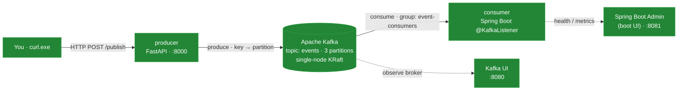
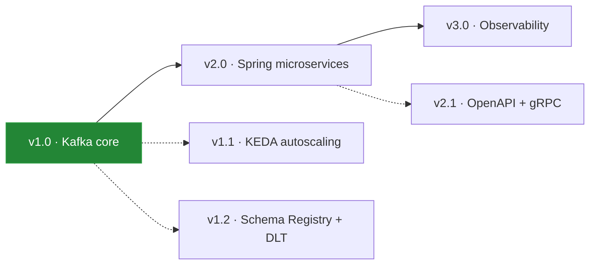

# Cloud-Native Learning Lab

A personal, hands-on lab for learning the **cloud-native / distributed systems** stack by building
real systems and watching how they behave — **Kafka, Spring Boot, Docker, and Kubernetes**, growing
over time. Built entirely on **open-source / free** tooling.

> Learning project, not a product. Grown in versioned batches (SemVer) as a monorepo.

## 📌 Progress so far

This lab has gone from an empty folder to a **running, observable event-streaming system**. We first
stood up a complete Windows development environment from scratch — Docker (via the open-source
**Rancher Desktop**), Python, **Java 21**, `kubectl`, and `kind` — working through the usual
real-world friction (a WSL update, a `PATH`-length truncation, and Python-version/`venv` wheel
gotchas) and folding every fix back into the manual so the next run is smooth. Alongside the tooling
we authored three complementary documents: a concepts **baseline** (`FOUNDATIONS.md`), a step-by-step
**hands-on manual** (`GUIDE.md`), and this overview. **Lab 1 (v1.0) is now live in Docker Compose:**
a Python/FastAPI producer publishes keyed events into single-node **Apache Kafka** (KRaft mode), a
**Spring Boot** consumer reads them via `@KafkaListener`, and two dashboards make the system
observable — **Kafka UI** for the broker (topics, partitions, lag) and **Spring Boot Admin** for the
consumer (health, metrics, live instances). Everything is versioned with SemVer and pushed to a
public GitHub repo.

**Done so far**
- ✅ Full Windows toolchain installed & verified (Docker/Rancher, Python, Java 21, kubectl, kind)
- ✅ Three docs authored: `README` · `FOUNDATIONS` (concepts) · `GUIDE` (versioned lab manual)
- ✅ Lab 1 scaffolded: producer (FastAPI) · consumer (Spring Boot/Gradle) · admin-server (Boot UI)
- ✅ Whole stack **built and running** in Docker Compose; both UIs working (`:8080`, `:8081`)
- ✅ Public GitHub repo with clean, incremental commit history

**Right now:** the v1.0 stack is up — next is creating the `events` topic and running the
partitioning / consumer-group **rebalancing experiments** (the core Kafka lesson).

### What's running today (Lab 1 architecture)



## 📚 The two documents

| File | What it is |
|---|---|
| **[FOUNDATIONS.md](FOUNDATIONS.md)** | The concepts — cloud-native & distributed-systems principles, architecture patterns, and the tool ecosystem. Read this first for the *why*. |
| **[GUIDE.md](GUIDE.md)** | The hands-on lab manual — step-by-step exercises with setup, commands, expected output, and checkpoints. This is the *how*. |

## 🗺️ Roadmap

| Version | Focus | Status |
|---|---|---|
| **v1.0** | Kafka core — partitioning, consumer groups, rebalancing, Docker → Kubernetes | 🟢 running (Docker) |
| v1.1 | KEDA lag-based autoscaling | planned |
| v1.2 | Schema Registry + Avro, dead-letter topics | planned |
| **v2.0** | Spring Boot microservices ecosystem (gateway, config, resilience, persistence) | planned |
| v2.1 | Contract-first REST (OpenAPI/Swagger) + gRPC service-to-service | planned |
| **v3.0** | Observability — metrics, logs, traces (Prometheus / Grafana / OpenTelemetry) | planned |



## 🧰 Tech stack (all open-source)

Apache Kafka · Python + FastAPI · Spring Boot (Java 21, Gradle) · Kafka UI · Spring Boot Admin ·
Docker (Rancher Desktop) · Kubernetes (kind) · and more as the roadmap grows. See
[FOUNDATIONS.md §8](FOUNDATIONS.md) for the full ecosystem map.

## 📂 Layout

```
cloud-native-learning-lab/
├── FOUNDATIONS.md          # concepts & baseline
├── GUIDE.md                # hands-on lab manual
└── labs/
    ├── 01-kafka/           # v1.x  (running)
    │   ├── docker-compose.yml
    │   ├── producer/       # Python FastAPI producer
    │   ├── consumer/       # Spring Boot consumer (Gradle)
    │   ├── admin-server/   # Spring Boot Admin (boot UI)
    │   └── k8s/            # kind manifests
    ├── 02-spring-microservices/   # v2.x
    └── 03-observability/   # v3.x
```

## 🚀 Getting started

1. Read **[FOUNDATIONS.md](FOUNDATIONS.md)** for the big picture.
2. Open **[GUIDE.md](GUIDE.md)** and work through **Lab 1 (v1.0)** — it starts with a from-scratch
   Windows environment setup, then Kafka on Docker, then on Kubernetes.

---

*Personal learning project — shared openly, but not seeking contributions.*
